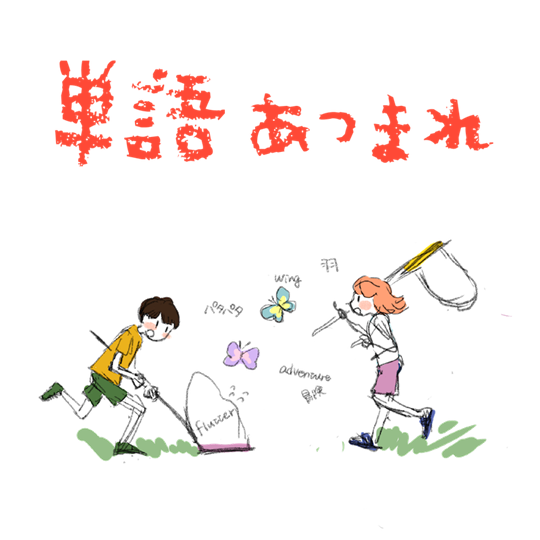

# Tango Atsumare

# Introduction

- Tango Atsumare helps users expand their vocabulary by making the process of creating high quality flashcards easier and more fun than ever before.
- You can use Tango Atsumare to review your new vocabulary using a spaced repetition flashcard review system, which contains an algorithm that allows users to spend less time studying, while improving retention.
- Tango Atsumare is also a community as newly created flashcards are added into a public feed.
    - Browse for new words at your leisure, adding them to your flashcard deck as you go.
    - Search for a new word you’ve recently encountered and find pictures that other users have uploaded containing that word.
    - See real world examples of those words in context.

## Media Links

---

- Video of our features

<!-- [https://www.youtube.com/watch?v=I5Eut86peEA](https://www.youtube.com/watch?v=I5Eut86peEA) -->

# Features

### OCR to Flashcard

We wanted to created the OCR to Flashcard feature because in most cases it would take 2 or 3 apps just to recreate the process that we have streamlined in this one step. In order to retain visual context for the target vocabulary, you’d have to take a picture of the word you want to learn, you’d need to

- take a picture of the target vocabulary.
- Use an OCR to Text application to convert the image to test
- Extract both the sentence, and the target vocabulary
- Search a dictionary for the meaning of the word
- go back and forth filling out fields just to create a single entry into your flashcard app of choice
- copy and paste the sentence, the target word, the meaning, and to retain as much context as possible, the original picture as well

### Picture Dictionary

A feed containing all recently uploaded pictures. Here you can see the pictures users have uploaded and the word they chose for their picture. On the feed you can:

- Scroll through and see what users have uploaded recently
- Click on an individual picture to get more details and upon clicking you can:
    - See more in-depth information on the card such as the full sentence, the chosen word, and the English meaning
    - Like the card
    - Add the card to your own collection
    - Report if the image is inappropriate
    - See tags that the original uploader has chosen for said card

### SRS Review

Short for “Spaced Repetition System” 

**Spaced repetition**
 is a flashcard based system for learning. Difficult flashcards are shown more frequently, while older and less difficult flashcards are shown less frequently. SRS’s have been proven to increase the rate of learning

## Future Features

---

- Initial tutorial for new users
- Localization for Japan
- Dark mode
- Public/private switch for user created flashcards
- Gamification - achievements/levels/progress bar/etc.

## Meet the Team

---

Keith

Graeme 

Kenny

Dean
